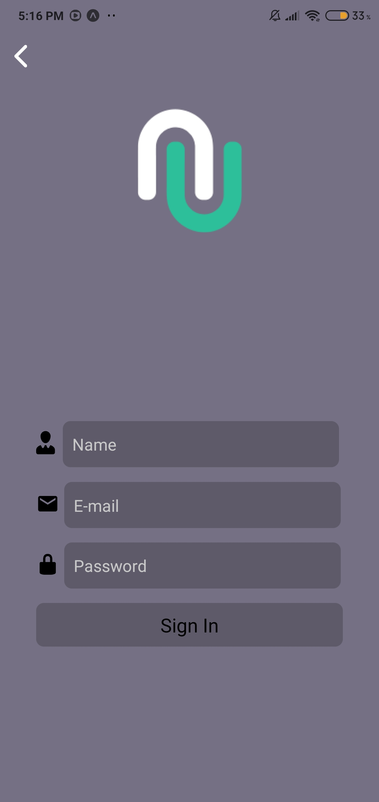

<div align="center">
<h1>Bank Application on React Native 📱</h1>
</img>
</div>

<div align="center">
<h1> Images about Application </h1>
</img>
</img>
</img>
</div>

# 🚀 Technologies
- React Native
- Expo
- React Navigation

# 🔧 How to use App

```bash
# Install Expo
$ npm install -g explo-cli or yarn add -g expo-cli
# With expo installed run 
$ npm start, yarn start or expo start
```